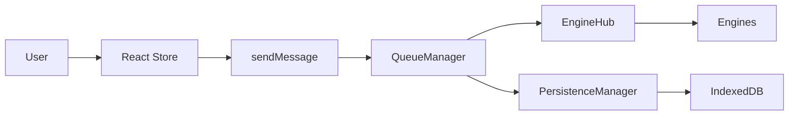
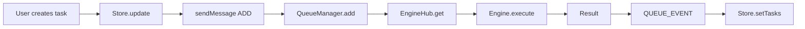
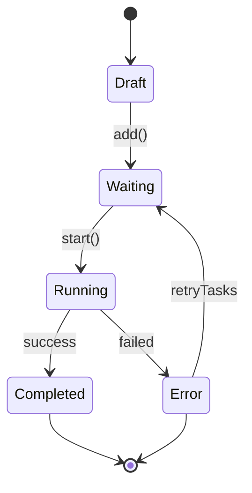
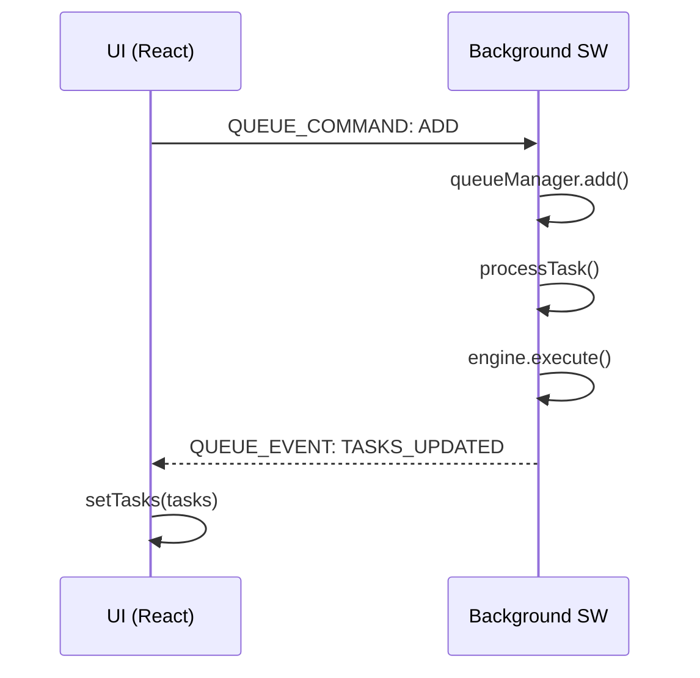

# kernel-script

[npm-version]: https://npmjs.org/package/kernel-script
[npm-downloads]: https://npmjs.org/package/kernel-script
[license]: https://mit-license.org
[license-url]: LICENSE

[](https://npmjs.org/package/kernel-script)
[](https://npmjs.org/package/kernel-script)
[](LICENSE)

Task queue manager for Chrome extensions with background processing, persistence, and React hooks.

## Table of Contents

- [Quick Start](#quick-start)
- [Features](#features)
- [Architecture](#architecture)
- [Installation](#installation)
- [Usage](#usage)
  - [Basic Setup](#basic-setup)
  - [React Hook](#react-hook)
  - [Advanced](#advanced)
- [API Reference](#api-reference)
  - [Core](#core)
  - [Hooks](#hooks)
  - [Store](#store)
  - [Queue Operations](#queue-operations)
- [Types](#types)
- [Troubleshooting](#troubleshooting)
- [Contributing](#contributing)
- [License](#license)

## Quick Start

```bash
npm install kernel-script
# or
bun add kernel-script
```

```typescript
import { setupKernelScript, createEngineRegistry, useWorker, createTaskStore } from 'kernel-script';

// 1. Create and register your engine
const registry = createEngineRegistry();
registry.register({
  keycard: 'my-platform',
  execute: async (ctx) => {
    // Your automation logic here
    return { success: true, output: 'Done' };
  },
});

// 2. Initialize in background script
setupKernelScript(registry, { debug: true });

// 3. Create store and use hook in React
const taskStore = createTaskStore({ name: 'my-tasks' });
const TaskQueue = () => {
  const { start, pause, addTask, publishTasks } = useWorker({
    engine: { keycard: 'my-platform', execute: async (ctx) => ({ success: true }) },
    identifier: 'default',
    funcs: taskStore,
  });
  // ...
};
```

```typescript
import { setupKernelScript, registerEngines, useWorker, createTaskStore } from 'kernel-script';

// 1. Define your engine
const myEngine = {
  keycard: 'my-platform',
  execute: async (ctx) => {
    // Your automation logic here
    return { success: true, output: 'Done' };
  },
};

// 2. Initialize in background script
setupKernelScript({ 'my-platform': myEngine });

// 3. Create store and use hook in React
const taskStore = createTaskStore({ name: 'my-tasks' });
const TaskQueue = () => {
  const { start, pause, addTask } = useWorker({
    keycard: 'my-platform',
    getIdentifier: () => 'default',
    funcs: taskStore,
  });
  // ...
};
```

## Examples

Check the [`example/`](example/) folder for a complete project using kernel-script.

```bash
cd example
bun install
bun dev
```

| File                                                                           | Description                      |
| ------------------------------------------------------------------------------ | -------------------------------- |
| [`example/src/background.ts`](example/src/background.ts)                       | Engine setup with registry       |
| [`example/src/hooks/use-task-worker.ts`](example/src/hooks/use-task-worker.ts) | Queue hook usage                 |
| [`example/src/stores/task.store.ts`](example/src/stores/task.store.ts)         | Store with IndexedDB persistence |

### New in v2.0

- **DirectManager** - Execute tasks immediately without queue
- **Engine Registry** - New registry-based engine system
- **QueueOptions** - Callback hooks for queue events
- **`publishTasks()`** - Publish local tasks to queue
- **`cancelTasks()`** / **`skipTaskIds()`** - Batch task operations
- **`setTaskConfig()`** - Runtime config updates
- **Task History** - Track completed tasks (max 1000)
- **Multi-select** - Select multiple tasks for batch operations

## Features

- **Task Queue Management** - Queue, schedule, and execute tasks with configurable concurrency
- **Background Processing** - Run tasks in Chrome background service workers
- **Persistence** - Queue state persists across extension restarts
- **React Hooks** - Built-in `useWorker` hook for React integration
- **Engine System** - Pluggable engine architecture for different task types
- **TypeScript Support** - Full TypeScript support with type definitions

## Architecture

### Data Flow



### Components

| Layer | Component           | Description                          |
| ----- | ------------------- | ------------------------------------ |
| UI    | TaskStore (Zustand) | Local state management               |
| UI    | useWorker Hook      | React hook interface                 |
| BG    | QueueManager        | Task scheduling, concurrency control |
| BG    | EngineHub           | Engine router/registry               |
| BG    | PersistenceManager  | IndexedDB persistence                |
| BG    | Engines             | Task executors                       |

### Task Flows

#### Task Execution Flow



### Task Lifecycle



### Persistence & Hydration

| Event           | Action                                                |
| --------------- | ----------------------------------------------------- |
| Browser restart | Service Worker restarts                               |
| Hydrate         | Load queue state from IndexedDB                       |
| RehydrateTasks  | Scan tasks, reset Running to Waiting, re-add to queue |

### Message Flow



### Main Operations

| Operation         | Description                   |
| ----------------- | ----------------------------- |
| `add(task)`       | Add 1 task to queue           |
| `addMany(tasks)`  | Add multiple tasks            |
| `start()`         | Start processing queue        |
| `pause()`         | Pause (don't cancel tasks)    |
| `resume()`        | Resume processing             |
| `stop()`          | Stop + halt all running tasks |
| `haltTask(id)`    | Halt 1 task to Waiting        |
| `cancelTask(id)`  | Cancel completely from list   |
| `retryTasks(ids)` | Retry failed tasks            |

## Installation

```bash
npm install kernel-script
# or
bun add kernel-script
```

## Usage

### Basic Setup

```typescript
import {
  setupKernelScript,
  createEngineRegistry,
  type TaskContext,
  type EngineResult,
} from 'kernel-script';

// Define your custom engine
const myEngine = {
  keycard: 'my-platform',

  async execute(ctx: TaskContext): Promise<EngineResult> {
    try {
      const tab = await chrome.tabs.create({ url: ctx.payload.url });
      await this.runAutomation(tab.id, ctx);
      const output = await this.getResult(tab.id);
      return { success: true, output };
    } catch (error) {
      return { success: false, error: error.message };
    }
  },
};

// Create registry and register engine
const registry = createEngineRegistry();
registry.register(myEngine);

// Initialize in your background script
setupKernelScript(registry, { debug: true });
// See: example/src/background.ts
```

### React Hook

```typescript
import { useWorker, createTaskStore, type Task } from 'kernel-script';

// Create a task store
const taskStore = createTaskStore({ name: 'my-tasks' });

// Use in your component
function TaskQueue() {
  const { start, pause, resume, stop, publishTasks, deleteTasks, retryTasks, cancelTasks, skipTaskIds } = useWorker({
    engine: { keycard: 'my-platform', execute: async (ctx) => ({ success: true }) },
    identifier: 'default',
    funcs: taskStore,
  });

  const handleAddTasks = (tasks: Task[]) => {
    publishTasks(tasks);  // Add tasks to queue
  };

  return (
    <div>
      <h2>Tasks: {taskStore.getTasks().length}</h2>
      <button onClick={start}>Start</button>
      <button onClick={pause}>Pause</button>
      <button onClick={resume}>Resume</button>
      <button onClick={stop}>Stop</button>
    </div>
  );
}
// See: example/src/hooks/use-task-worker.ts
```

### Store with Persistence

```typescript
import { createTaskStore, createIndexedDBStorage } from 'kernel-script';

const store = createTaskStore({
  name: 'my-tasks',
  storage: createIndexedDBStorage('my-storage'),
  partialize: (state) => ({
    config: state.config,
  }),
  extend: (set, _get) => ({
    config: { theme: 'light' },
    updateConfig: (updates) => set((state) => ({
      config: { ...state.config, ...updates },
    })),
  })),
});
// Store includes: tasks, taskHistory, selectedIds, taskConfig
// See: example/src/stores/task.store.ts
```

### Direct Execution (No Queue)

```typescript
import { getDirectManager, type Task, type EngineResult } from 'kernel-script';

const directManager = getDirectManager();

const task: Task = {
  id: 'task-001',
  no: 1,
  name: 'Generate cat image',
  status: 'Waiting',
  progress: 0,
  payload: { url: 'https://example.com' },
};

const result: EngineResult = await directManager.execute('my-platform', task);
// Use direct execution when you don't need queue management
```

### Advanced

```typescript
import { getQueueManager, TaskConfig } from 'kernel-script';

// Get queue manager instance
const queueManager = getQueueManager();

// Configure queue
const config: TaskConfig = {
  threads: 3,
  delayMin: 1000,
  delayMax: 5000,
  stopOnErrorCount: 5,
};

// Add tasks
await queueManager.add('my-platform', 'default', {
  id: 'task-001',
  no: 1,
  name: 'Generate cat image',
  status: 'Waiting',
  progress: 0,
  payload: { prompt: 'a cute cat' },
});

// Add multiple tasks
await queueManager.addMany('my-platform', 'default', [
  { id: 'task-002', no: 2, name: 'Task 2', status: 'Waiting', progress: 0, payload: {} },
  { id: 'task-003', no: 3, name: 'Task 3', status: 'Waiting', progress: 0, payload: {} },
]);

// Start processing
queueManager.start('my-platform', 'default');
```

## API Reference

### Core

| Export                                 | Description                                  |
| -------------------------------------- | -------------------------------------------- |
| `QueueManager`                         | Main queue manager class                     |
| `getQueueManager()`                    | Get queue manager singleton                  |
| `getDirectManager()`                   | Direct task execution without queue          |
| `TaskContext`                          | Context for task execution with abort signal |
| `setupKernelScript(registry, options)` | Initialize background engine with registry   |
| `createEngineRegistry()`               | Create custom engine registry                |
| `registerEngines(engines, qm)`         | Register engines to queue manager            |
| `persistenceManager`                   | Persistence layer                            |
| `sleep(ms)`                            | Promise-based sleep function                 |

### Queue Options

| Option                        | Description                         |
| ----------------------------- | ----------------------------------- |
| `debug?: boolean`             | Enable debug logging                |
| `storageKey?: string`         | IndexedDB storage key               |
| `defaultConcurrency?: number` | Default concurrency (default: 1)    |
| `onTaskStart?: fn`            | Callback when task starts           |
| `onTaskComplete?: fn`         | Callback when task completes        |
| `onQueueEmpty?: fn`           | Callback when queue becomes empty   |
| `onPendingCountChange?: fn`   | Callback when pending count changes |
| `onTasksUpdate?: fn`          | Callback when tasks are updated     |

### Hooks

| Hook                | Description                     | Usage                                      |
| ------------------- | ------------------------------- | ------------------------------------------ |
| `useWorker(config)` | React hook for queue operations | `useWorker({ engine, identifier, funcs })` |

### Store

| Function                   | Description                    |
| -------------------------- | ------------------------------ |
| `createTaskStore(options)` | Create Zustand store for tasks |

### Queue Operations

| Operation                                  | Description                   |
| ------------------------------------------ | ----------------------------- |
| `add(keycard, identifier, task)`           | Add 1 task to queue           |
| `addMany(keycard, identifier, tasks)`      | Add multiple tasks            |
| `start(keycard, identifier)`               | Start processing queue        |
| `pause(keycard, identifier)`               | Pause (don't cancel tasks)    |
| `resume(keycard, identifier)`              | Resume processing             |
| `stop(keycard, identifier)`                | Stop + halt all running tasks |
| `clear(keycard, identifier)`               | Clear all tasks               |
| `cancelTask(keycard, identifier, taskId)`  | Cancel + remove task          |
| `haltTask(keycard, identifier, taskId)`    | Halt task (reset to Waiting)  |
| `getStatus(keycard, identifier)`           | Get queue status              |
| `getTasks(keycard, identifier)`            | Get all tasks                 |
| `retryTasks(keycard, identifier, taskIds)` | Retry failed tasks            |
| `setConcurrency(keycard, concurrency)`     | Set concurrency               |

## Types

```typescript
// Task status
type TaskStatus = 'Draft' | 'Waiting' | 'Running' | 'Completed' | 'Error' | 'Previous' | 'Skipped';

// Task definition
interface Task {
  id: string;
  no: number;
  name: string;
  status: TaskStatus;
  progress: number;
  payload: Record<string, any>;
  output?: unknown;
  errorMessage?: string;
  isQueued?: boolean;
  createAt?: number;
  updateAt?: number;
  [key: string]: unknown;
}

// Queue configuration
interface TaskConfig {
  threads: number;
  delayMin: number;
  delayMax: number;
  stopOnErrorCount: number;
}

// Queue status
interface QueueStatus {
  size: number;
  pending: number;
  isRunning: boolean;
}

// Queue options (callbacks)
interface QueueOptions {
  debug?: boolean;
  storageKey?: string;
  defaultConcurrency?: number;
  onTaskStart?: (keycard: string, identifier: string, taskId: string) => void;
  onTaskComplete?: (
    keycard: string,
    identifier: string,
    taskId: string,
    result: EngineResult
  ) => void;
  onQueueEmpty?: (keycard: string, identifier: string) => void;
  onPendingCountChange?: (keycard: string, identifier: string, count: number) => void;
  onTasksUpdate?: (keycard: string, identifier: string, tasks: Task[], status: QueueStatus) => void;
}

// Setup options
interface SetupOptions {
  debug?: boolean;
  storageKey?: string;
}

// Engine interface
interface BaseEngine {
  keycard: string;
  execute(ctx: TaskContext): Promise<EngineResult>;
}

// Engine result
interface EngineResult {
  success: boolean;
  output?: unknown;
  error?: string;
}

// Worker methods (hook return type)
interface WorkerMethods {
  addTask: (task: Task) => Promise<any>;
  start: () => Promise<any>;
  stop: () => Promise<any>;
  pause: () => Promise<any>;
  resume: () => Promise<any>;
  clear: () => Promise<any>;
  getStatus: () => Promise<any>;
  getTasks: () => Promise<any>;
  cancelTask: (taskId: string) => Promise<any>;
  cancelTasks: (taskIds: string[]) => Promise<any>;
  publishTasks: (tasks: Task[]) => Promise<any>;
  deleteTasks: (taskIds: string[]) => Promise<any>;
  retryTasks: (taskIds: string[]) => Promise<any>;
  skipTaskIds: (taskIds: string[]) => Promise<any>;
  setTaskConfig: (taskConfig: TaskConfig) => Promise<any>;
}
```

## Troubleshooting

### Common Issues

**Q: Tasks not executing after adding**
A: Make sure to call `start()` after adding tasks, or use `publishTasks()` to add and queue in one step.

**Q: Queue not persisting after extension restart**
A: Verify `setupKernelScript()` is called on bootstrap. Check IndexedDB permissions.

**Q: React hook not updating**
A: Ensure your store is passed correctly to `useWorker` funcs parameter. Check chrome.runtime.id exists.

**Q: Engine not found**
A: Register your engine with `createEngineRegistry().register(engine)` before calling `setupKernelScript()`.

**Q: "No engine registered for platform"**
A: Make sure your engine's keycard matches the keycard you're using in addTask/publishTasks.

**Q: TypeScript errors on import**
A: Ensure peer dependencies are installed: `npm install react react-dom zustand`

**Q: Where do I start?**
A: Check the [`example/`](example/) folder for a complete implementation.

## Contributing

1. Fork the repository
2. Create a feature branch: `git checkout -b feature/my-feature`
3. Make your changes
4. Run tests: `bun run build`
5. Submit a pull request

## License

MIT License - see [LICENSE](LICENSE) for details.
