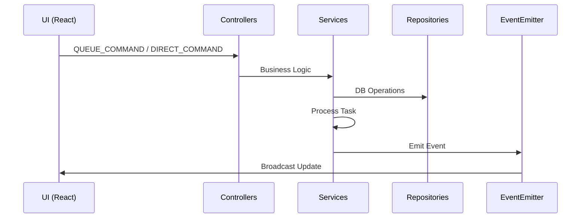
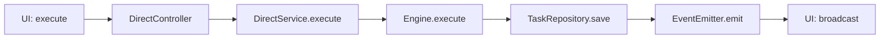
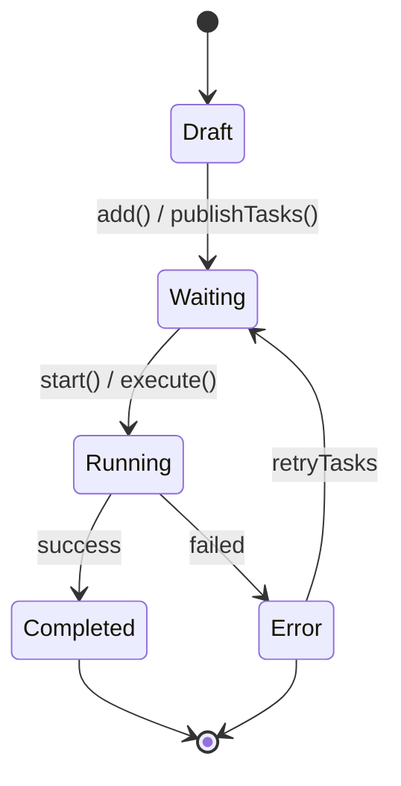

# kernel-script

[npm-version]: https://npmjs.org/package/kernel-script
[npm-downloads]: https://npmjs.org/package/kernel-script
[license]: https://mit-license.org
[license-url]: LICENSE

[](https://npmjs.org/package/kernel-script)
[](https://npmjs.org/package/kernel-script)
[](LICENSE)

Task queue manager for Chrome extensions with background processing, persistence, and React hooks.

## Table of Contents

- [Quick Start](#quick-start)
- [Features](#features)
- [Architecture](#architecture)
  - [Components](#components)
  - [Data Flow](#data-flow)
  - [Task Flows](#task-flows)
  - [Task Lifecycle](#task-lifecycle)
  - [Persistence & Hydration](#persistence--hydration)
- [Installation](#installation)
- [Usage](#usage)
  - [Basic Setup](#basic-setup)
  - [React Hook](#react-hook)
  - [Store with Persistence](#store-with-persistence)
- [API Reference](#api-reference)
  - [Core](#core)
  - [Controllers](#controllers)
  - [Services](#services)
  - [Queue Options](#queue-options)
  - [Direct Options](#direct-options)
  - [Queue Service Methods](#queue-service-methods)
  - [Task Service Methods](#task-service-methods)
  - [Direct Service Methods](#direct-service-methods)
  - [Hooks](#hooks)
  - [Store](#store)
  - [Bootstrap & Setup](#bootstrap--setup)
  - [Controllers (Background Script)](#controllers-background-script)
- [Types](#types)
- [Troubleshooting](#troubleshooting)
- [Contributing](#contributing)
- [License](#license)

## Quick Start

```bash
npm install kernel-script
# or
bun add kernel-script
```

```typescript
import { bootstrap, createEngineRegistry, useWorker } from 'kernel-script';

const registry = createEngineRegistry();
registry.register({
  keycard: 'my-platform',
  execute: async (ctx) => ({ success: true, output: 'Done' }),
});

bootstrap(registry, { debug: true });

function TaskQueue() {
  const { queueStart, queueStop, publishTasks } = useWorker({
    engine: { keycard: 'my-platform', execute: async (ctx) => ({ success: true }) },
    identifier: 'default',
  });
  // ...
}
```

## Examples

Check the [`example/`](example/) folder for a complete project.

```bash
cd example
bun install
bun dev
```

## Features

- **Task Queue Management** - Queue, schedule, and execute tasks with configurable concurrency
- **Background Processing** - Run tasks in Chrome background service workers
- **Persistence** - Queue state persists across extension restarts
- **React Hooks** - Built-in `useWorker` hook for React integration
- **Engine System** - Pluggable engine architecture for different task types
- **TypeScript Support** - Full TypeScript support with type definitions

## Architecture

This library uses a layered architecture with Controllers, Services, and Repositories to manage task execution in Chrome extensions.

### Components

| Layer        | Component        | Description                                |
| ------------ | ---------------- | ------------------------------------------ |
| Bootstrap    | bootstrap        | Initialize background script               |
| Controllers  | QueueController  | Handle QUEUE_COMMAND (add, start, stop...) |
| Controllers  | DirectController | Handle DIRECT_COMMAND (execute, stop...)   |
| Services     | TaskService      | Task CRUD: create, update, publishTasks    |
| Services     | QueueService     | Queue management, concurrency, callbacks   |
| Services     | DirectService    | Direct execution without queue             |
| Repositories | TaskRepository   | IndexedDB persistence                      |
| Events       | EventEmitter     | Broadcast updates to UI                    |

### Data Flow



### Task Flows

#### Queue Execution Flow

```mermaid
graph LR
    A[UI: createTask] --> B[QueueController]
    B --> C[TaskService.createTask]
    C --> D[TaskRepository.save]
    D --> E[QueueService.add]
    E --> F[QueueService.processTask]
    F --> G[Engine.execute]
    G --> H[TaskRepository.save]
    H --> I[EventEmitter.emit]
    I --> J[UI: broadcast]
```



#### Direct Execution Flow



### Task Lifecycle



### Persistence & Hydration

| Event           | Action                                       |
| --------------- | -------------------------------------------- |
| Browser restart | Service Worker restarts                      |
| bootstrap()     | Load queue state from IndexedDB              |
| RehydrateTasks  | Scan tasks, reset Running to Waiting, re-add |

## Installation

```bash
npm install kernel-script
# or
bun add kernel-script
```

## Usage

### Basic Setup

```typescript
import {
  bootstrap,
  createEngineRegistry,
  type TaskContext,
  type EngineResult,
} from 'kernel-script';

const myEngine = {
  keycard: 'my-platform',

  async execute(ctx: TaskContext): Promise<EngineResult> {
    try {
      const tab = await chrome.tabs.create({ url: ctx.payload.url });
      await this.runAutomation(tab.id, ctx);
      const output = await this.getResult(tab.id);
      return { success: true, output };
    } catch (error) {
      return { success: false, error: error.message };
    }
  },
};

const registry = createEngineRegistry();
registry.register(myEngine);

bootstrap(registry, { debug: true });
```

### React Hook

```typescript
import { useWorker, type Task } from 'kernel-script';

function TaskQueue() {
  const { queueStart, queueStop, publishTasks, deleteTasks, retryTask, queueCancelTask, skipTask } =
    useWorker({
      engine: { keycard: 'my-platform', execute: async (ctx) => ({ success: true }) },
      identifier: 'default',
    });

  const handleAddTasks = (tasks: Task[]) => {
    publishTasks(tasks);
  };
  // ...
}
```

## API Reference

### Core

| Export                          | Description                                |
| ------------------------------- | ------------------------------------------ |
| `bootstrap(registry, options)`  | Initialize background script with services |
| `setupKernelScript(config)`     | Legacy init (backward compatible)          |
| `createEngineRegistry()`        | Create engine registry                     |
| `registerEngines(engines, svc)` | Register engines to service                |

### Controllers

| Export                     | Description                   |
| -------------------------- | ----------------------------- |
| `createQueueController()`  | Create queue command handler  |
| `createDirectController()` | Create direct command handler |

### Services

| Export                     | Description                          |
| -------------------------- | ------------------------------------ |
| `getQueueService(options)` | Get queue service singleton          |
| `taskService`              | Task CRUD service (singleton)        |
| `directService`            | Direct execution service (singleton) |
| `taskRepository`           | IndexedDB repository (singleton)     |
| `emitEvent(event, data)`   | Emit event to all UI clients         |
| `EVENTS`                   | Event type constants                 |

### Queue Options

| Option                        | Description                         |
| ----------------------------- | ----------------------------------- |
| `debug?: boolean`             | Enable debug logging                |
| `storageKey?: string`         | IndexedDB storage key               |
| `defaultConcurrency?: number` | Default concurrency (default: 1)    |
| `onTaskStart?: fn`            | Callback when task starts           |
| `onTaskComplete?: fn`         | Callback when task completes        |
| `onQueueEmpty?: fn`           | Callback when queue becomes empty   |
| `onPendingCountChange?: fn`   | Callback when pending count changes |
| `onTasksUpdate?: fn`          | Callback when tasks are updated     |

### Direct Options

| Option                | Description                   |
| --------------------- | ----------------------------- |
| `debug?: boolean`     | Enable debug logging          |
| `onTasksUpdate?: fn`  | Callback when task is updated |
| `onTaskComplete?: fn` | Callback when task completes  |

### Queue Service Methods

| Method                                     | Description                   |
| ------------------------------------------ | ----------------------------- |
| `add(keycard, identifier, task)`           | Add 1 task to queue           |
| `addMany(keycard, identifier, tasks)`      | Add multiple tasks            |
| `start(keycard, identifier)`               | Start processing queue        |
| `pause(keycard, identifier)`               | Pause (don't cancel tasks)    |
| `resume(keycard, identifier)`              | Resume processing             |
| `stop(keycard, identifier)`                | Stop + halt all running tasks |
| `clear(keycard, identifier)`               | Clear all tasks               |
| `cancelTask(keycard, identifier, taskId)`  | Cancel + remove task          |
| `haltTask(keycard, identifier, taskId)`    | Halt task (reset to Waiting)  |
| `getStatus(keycard, identifier)`           | Get queue status              |
| `getTasks(keycard, identifier)`            | Get all tasks                 |
| `retryTasks(keycard, identifier, taskIds)` | Retry failed tasks            |
| `setConcurrency(keycard, concurrency)`     | Set concurrency               |

### Task Service Methods

| Method                    | Description        |
| ------------------------- | ------------------ |
| `createTask(task)`        | Create new task    |
| `updateTask(id, updates)` | Update task        |
| `deleteTask(id)`          | Delete task        |
| `getTask(id)`             | Get task by ID     |
| `publishTasks(tasks)`     | Add tasks to queue |

### Direct Service Methods

| Method                           | Description           |
| -------------------------------- | --------------------- |
| `execute(keycard, id, task)`     | Execute task directly |
| `stop(keycard, id, taskId)`      | Stop running task     |
| `isRunning(keycard, id, taskId)` | Check if running      |

### Hooks

| Hook                | Description                     | Usage                                       |
| ------------------- | ------------------------------- | ------------------------------------------- |
| `useWorker(config)` | React hook for queue operations | `useWorker({ engine, identifier, debug? })` |

### Bootstrap & Setup

```typescript
import { bootstrap, createEngineRegistry } from 'kernel-script';

const registry = createEngineRegistry();
registry.register({
  keycard: 'my-platform',
  execute: async (ctx) => ({ success: true, output: 'Done' }),
});

bootstrap(registry, { debug: true });
```

### Controllers (Background Script)

```typescript
import { createQueueController, createDirectController } from 'kernel-script';

const queueController = createQueueController();
const directController = createDirectController();

chrome.runtime.onMessage.addListener((message, sender, sendResponse) => {
  if (message.type === 'QUEUE_COMMAND') {
    queueController.handle(message, sendResponse);
  } else if (message.type === 'DIRECT_COMMAND') {
    directController.handle(message, sendResponse);
  }
});
```

## Types

```typescript
// Task status
type TaskStatus = 'Draft' | 'Waiting' | 'Running' | 'Completed' | 'Error' | 'Previous' | 'Skipped';

// Task definition
interface Task {
  id: string;
  no: number;
  name: string;
  status: TaskStatus;
  progress: number;
  payload: Record<string, any>;
  result?: EngineResult;
  errorMessage?: string;
  isQueued: boolean;
  createAt: number;
  updateAt: number;
  histories: TaskHistory[];
  [key: string]: any;
}

// Task input (for creating tasks)
type TaskInput = {
  name: Task['name'];
  payload: Task['payload'];
  [key: string]: any;
};

// Task history
type TaskHistory = {
  result: EngineResult;
  updateAt: number;
};

// Async result
type AsyncResult = {
  success: boolean;
};

// Queue configuration
type TaskConfig = {
  threads: number;
  delayMin: number;
  delayMax: number;
  stopOnErrorCount: number;
  [key: string]: any;
};

// Queue status
type QueueStatus = {
  size: number;
  pending: number;
  isRunning: boolean;
};

// Queue options (callbacks)
type QueueOptions = {
  debug?: boolean;
  storageKey?: string;
  defaultConcurrency?: number;
  onTaskStart?: (keycard: string, identifier: string, taskId: string) => void;
  onTaskComplete?: (
    keycard: string,
    identifier: string,
    taskId: string,
    result: EngineResult
  ) => void;
  onQueueEmpty?: (keycard: string, identifier: string) => void;
  onPendingCountChange?: (keycard: string, identifier: string, count: number) => void;
  onTasksUpdate?: (keycard: string, identifier: string, tasks: Task[], status: QueueStatus) => void;
};

// Direct options (callbacks)
type DirectOptions = {
  debug?: boolean;
  storageKey?: string;
  onTasksUpdate?: (keycard: string, identifier: string, task: Task) => void;
  onTaskComplete?: (
    keycard: string,
    identifier: string,
    taskId: string,
    result: EngineResult
  ) => void;
};

// Setup options
type SetupOptions = {
  debug?: boolean;
  storageKey?: string;
};

// Engine interface
type BaseEngine = {
  keycard: string;
  execute(ctx: any): Promise<EngineResult>;
};

// Engine result
type EngineResult = {
  success: boolean;
  output?: unknown;
  error?: string;
};

// Worker methods (hook return type)
interface WorkerMethods {
  tasks: Task[];
  isRunning: boolean;
  selectedIds: string[];
  taskConfig: TaskConfig;
  setTaskConfig: (config: TaskConfig) => Promise<void>;
  createTask: (input: TaskInput) => Promise<AsyncResult>;
  createTasks: (inputs: TaskInput[]) => Promise<AsyncResult>;
  deleteTask: (taskId: string) => Promise<AsyncResult>;
  deleteTasks: (taskIds: string[]) => Promise<AsyncResult>;
  publishTasks: (taskIds: string[]) => Promise<AsyncResult>;
  unpublishTasks: (taskIds: string[]) => Promise<AsyncResult>;
  queueStart: () => Promise<AsyncResult>;
  queueStop: () => Promise<AsyncResult>;
  queueCancelTask: (taskId: string) => Promise<AsyncResult>;
  queueClear: () => Promise<AsyncResult>;
  retryTask: (taskId: string) => Promise<AsyncResult>;
  skipTask: (taskId: string) => Promise<AsyncResult>;
  toggleSelect: (taskId: string) => Promise<void>;
  toggleSelectAll: (taskIds?: string[]) => Promise<void>;
  clearSelected: () => Promise<void>;
  runTask: (taskId: string) => Promise<EngineResult>;
  stopTask: (taskId: string) => Promise<AsyncResult>;
  sync: () => void;
}
```

## Troubleshooting

### Common Issues

**Q: Tasks not executing after adding**
A: Make sure to call `queueStart()` after adding tasks, or use `publishTasks()` to add and queue in one step.

**Q: Queue not persisting after extension restart**
A: Verify `bootstrap()` is called on startup. Check IndexedDB permissions.

**Q: React hook not updating**
A: Ensure your store is passed correctly to `useWorker` funcs parameter. Check chrome.runtime.id exists.

**Q: Engine not found**
A: Register your engine with `createEngineRegistry().register(engine)` before calling `bootstrap()`.

**Q: "No engine registered for platform"**
A: Make sure your engine's keycard matches the keycard you're using in addTask/publishTasks.

**Q: TypeScript errors on import**
A: Ensure peer dependencies are installed: `npm install react react-dom`

**Q: Where do I start?**
A: Check the [`example/`](example/) folder for a complete implementation.

## Contributing

1. Fork the repository
2. Create a feature branch: `git checkout -b feature/my-feature`
3. Make your changes
4. Run tests: `bun run build`
5. Submit a pull request

## License

MIT License - see [LICENSE](LICENSE) for details.
