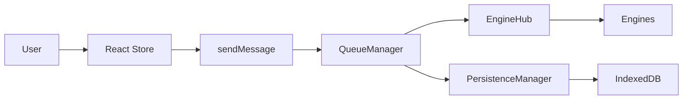
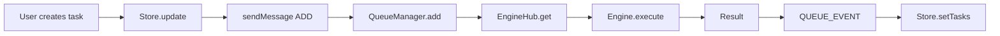
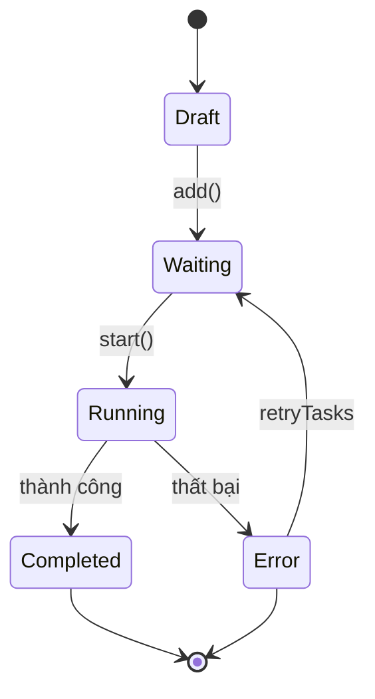
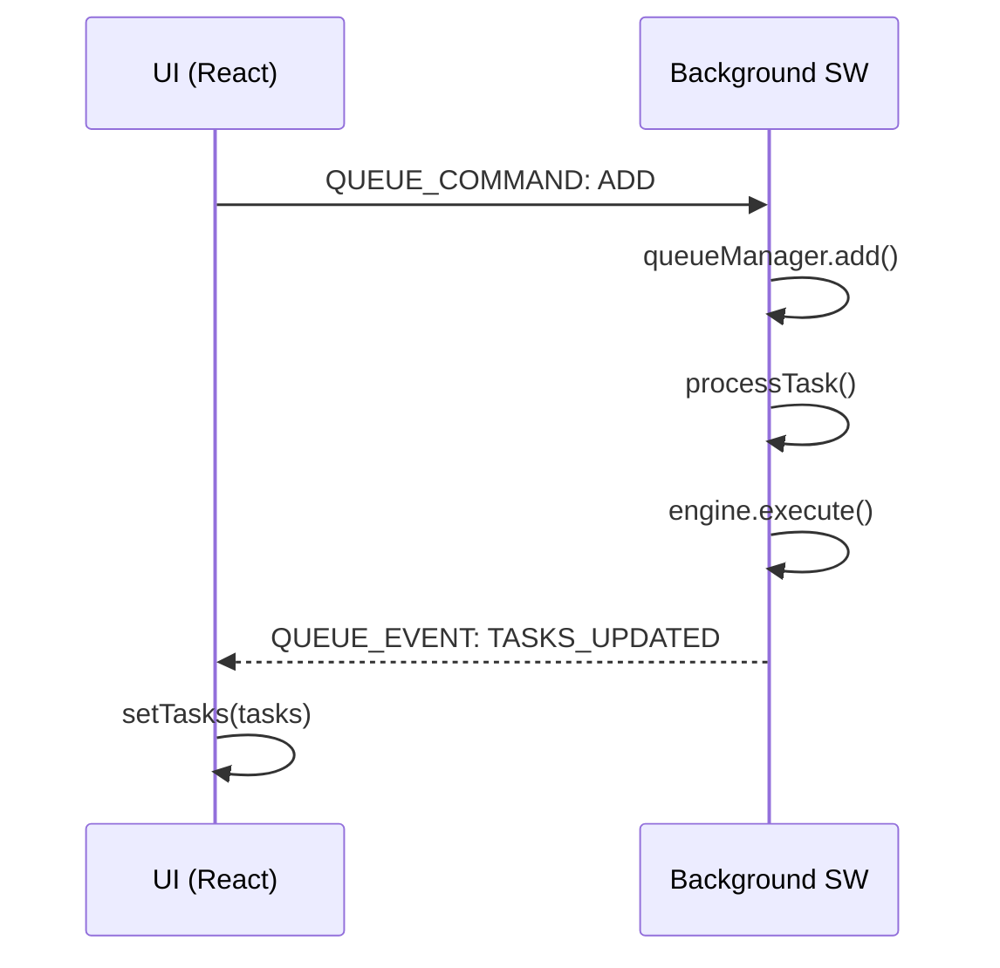

# kernel-script

[npm-version]: https://npmjs.org/package/kernel-script
[npm-downloads]: https://npmjs.org/package/kernel-script
[license]: https://mit-license.org
[license-url]: LICENSE

[](https://npmjs.org/package/kernel-script)
[](https://npmjs.org/package/kernel-script)
[](LICENSE)

Trình quản lý hàng đợi tác vụ cho Chrome extensions với xử lý background, persistence, và React hooks.

## Mục lục

- [Bắt đầu nhanh](#bắt-đầu-nhanh)
- [Tính năng](#tính-năng)
- [Kiến trúc](#kiến-trúc)
- [Cài đặt](#cài-đặt)
- [Sử dụng](#sử-dụng)
  - [Thiết lập cơ bản](#thiết-lập-cơ-bản)
  - [React Hook](#react-hook)
  - [Nâng cao](#nâng-cao)
- [Tham chiếu API](#tham-chiếu-api)
  - [Core](#core)
  - [Hooks](#hooks)
  - [Store](#store)
  - [Thao tác hàng đợi](#thao-tác-hàng-đợi)
- [Các kiểu dữ liệu](#các-kiểu-dữ-liệu)
- [Khắc phục sự cố](#khắc-phục-sự-cố)
- [Đóng góp](#đóng-góp)
- [Giấy phép](#giấy-phép)

## Bắt đầu nhanh

```bash
npm install kernel-script
# hoặc
bun add kernel-script
```

```typescript
import {
  setupBackgroundEngine,
  registerAllEngines,
  useWorker,
  createTaskStore,
} from 'kernel-script';

// 1. Định nghĩa engine của bạn
const myEngine = {
  keycard: 'my-platform',
  execute: async (ctx) => {
    // Logic tự động hóa của bạn ở đây
    return { success: true, output: 'Done' };
  },
};

// 2. Khởi tạo trong background script
setupBackgroundEngine({ 'my-platform': myEngine });

// 3. Tạo store và sử dụng hook trong React
const taskStore = createTaskStore({ name: 'my-tasks' });
const TaskQueue = () => {
  const { start, pause, addTask } = useWorker({
    keycard: 'my-platform',
    getIdentifier: () => 'default',
    funcs: taskStore,
  });
  // ...
};
```

## Ví dụ

Xem thư mục [`example/`](example/) để xem project hoàn chỉnh sử dụng kernel-script.

```bash
cd example
bun install
bun dev
```

| File                                                                         | Mô tả                           |
| ---------------------------------------------------------------------------- | ------------------------------- |
| [`example/src/background.ts`](example/src/background.ts)                     | Thiết lập engine                |
| [`example/src/hooks/use-task-worker.ts`](example/src/hooks/use-task-worker.ts) | Cách sử dụng queue hook         |
| [`example/src/stores/task.store.ts`](example/src/stores/task.store.ts)       | Store với IndexedDB persistence |

## Tính năng

- **Quản lý hàng đợi tác vụ** - Queue, lên lịch, và thực thi tác vụ với concurrency có thể cấu hình
- **Xử lý Background** - Chạy tác vụ trong Chrome background service workers
- **Persistence** - Trạng thái hàng đợi được lưu qua các lần khởi động extension
- **React Hooks** - Hook `useQueue` tích hợp sẵn cho React
- **Hệ thống Engine** - Kiến trúc engine có thể mở rộng cho các loại tác vụ khác nhau
- **Hỗ trợ TypeScript** - Hỗ trợ TypeScript đầy đủ với type definitions

## Kiến trúc

### Luồng dữ liệu



### Các thành phần

| Layer | Component           | Mô tả                                  |
| ----- | ------------------- | -------------------------------------- |
| UI    | TaskStore (Zustand) | Quản lý state cục bộ                   |
| UI    | useQueue Hook       | Interface React hook                   |
| BG    | QueueManager        | Lên lịch tác vụ, kiểm soát concurrency |
| BG    | EngineHub           | Engine router/registry                 |
| BG    | PersistenceManager  | IndexedDB persistence                  |
| BG    | Engines             | Thực thi tác vụ                        |

### Luồng tác vụ

#### Luồng thực thi tác vụ



### Vòng đời tác vụ



### Persistence & Hydration

| Sự kiện                   | Hành động                                                |
| ------------------------- | -------------------------------------------------------- |
| Khởi động lại trình duyệt | Service Worker khởi động lại                             |
| Hydrate                   | Load trạng thái hàng đợi từ IndexedDB                    |
| RehydrateTasks            | Quét tác vụ, reset Running → Waiting, thêm lại vào queue |

### Luồng tin nhắn



### Các thao tác chính

| Thao tác          | Mô tả                                |
| ----------------- | ------------------------------------ |
| `add(task)`       | Thêm 1 tác vụ vào hàng đợi           |
| `addMany(tasks)`  | Thêm nhiều tác vụ                    |
| `start()`         | Bắt đầu xử lý hàng đợi               |
| `pause()`         | Tạm dừng (không hủy tác vụ)          |
| `resume()`        | Tiếp tục xử lý                       |
| `stop()`          | Dừng và halt tất cả tác vụ đang chạy |
| `haltTask(id)`    | Halt 1 tác vụ → Waiting              |
| `cancelTask(id)`  | Hủy hoàn toàn khỏi danh sách         |
| `retryTasks(ids)` | Thử lại các tác vụ thất bại          |

## Cài đặt

```bash
npm install kernel-script
# hoặc
bun add kernel-script
```

## Sử dụng

### Thiết lập cơ bản

```typescript
import { setupBackgroundEngine, registerAllEngines } from 'kernel-script';
import type { BaseEngine, Task, EngineResult } from 'kernel-script';

// Định nghĩa engine tùy chỉnh của bạn
const myEngine: BaseEngine = {
  keycard: 'my-platform',

  async execute(ctx: Task): Promise<EngineResult> {
    try {
      const tab = await chrome.tabs.create({ url: ctx.payload.url });
      await this.runAutomation(tab.id, ctx);
      const output = await this.getResult(tab.id);
      return { success: true, output };
    } catch (error) {
      return { success: false, error: error.message };
    }
  },

  cancel(taskId: string): void {
    // Logic hủy ở đây
  },
};

// Khởi tạo trong background script của bạn
setupBackgroundEngine({ 'my-platform': myEngine });

// Đăng ký tất cả built-in engines (tùy chọn)
registerAllEngines();
// See: example/src/background.ts
```

### React Hook

```typescript
import { useWorker, createTaskStore } from 'kernel-script';

// Tạo task store
const taskStore = createTaskStore({ name: 'my-tasks' });

// Sử dụng trong component của bạn
function TaskQueue() {
  const { start, pause, resume, stop, addTask, deleteTasks, retryTasks } = useWorker({
    keycard: 'my-platform',
    getIdentifier: () => 'default',
    funcs: taskStore,
  });

  return (
    <div>
      <h2>Tasks: {taskStore.getTasks().length}</h2>
      <button onClick={start}>Start</button>
      <button onClick={pause}>Pause</button>
      <button onClick={resume}>Resume</button>
      <button onClick={stop}>Stop</button>
    </div>
  );
}
// See: example/src/hooks/use-task-worker.ts
```

### Store với Persistence

```typescript
import { createTaskStore, createIndexedDBStorage } from 'kernel-script';

const store = createTaskStore({
  name: 'my-tasks',
  storage: createIndexedDBStorage('my-storage'),
  partialize: (state) => ({
    config: state.config,
  }),
  extend: (set, _get) => ({
    config: { theme: 'light' },
    updateConfig: (updates) => set((state) => ({
      config: { ...state.config, ...updates },
    })),
  })),
});
// See: example/src/stores/task.store.ts
```

### Nâng cao

```typescript
import { getQueueManager, TaskConfig } from 'kernel-script';

// Lấy instance queue manager
const queueManager = getQueueManager();

// Cấu hình hàng đợi
const config: TaskConfig = {
  threads: 3,
  delayMin: 1000,
  delayMax: 5000,
  stopOnErrorCount: 5,
};

// Thêm tác vụ
await queueManager.add('my-platform', 'default', {
  id: 'task-001',
  no: 1,
  name: 'Generate cat image',
  status: 'Waiting',
  progress: 0,
  payload: { prompt: 'a cute cat' },
});

// Thêm nhiều tác vụ
await queueManager.addMany('my-platform', 'default', [
  { id: 'task-002', no: 2, name: 'Task 2', status: 'Waiting', progress: 0, payload: {} },
  { id: 'task-003', no: 3, name: 'Task 3', status: 'Waiting', progress: 0, payload: {} },
]);

// Bắt đầu xử lý
queueManager.start('my-platform', 'default');
```

## Tham chiếu API

### Core

| Export                           | Mô tả                                       |
| -------------------------------- | ------------------------------------------- |
| `QueueManager`                   | Class quản lý hàng đợi chính                |
| `getQueueManager()`              | Lấy singleton queue manager                 |
| `TaskContext`                    | Context để thực thi tác vụ với abort signal |
| `setupBackgroundEngine(engines)` | Khởi tạo background engine                  |
| `engineHub`                      | Registry của các engines                    |
| `persistenceManager`             | Lớp persistence                             |
| `registerAllEngines()`           | Đăng ký tất cả built-in engines             |
| `sleep(ms)`                      | Hàm sleep dạng Promise                      |

### Hooks

| Hook                | Mô tả                            | Cách dùng                                      |
| ------------------- | -------------------------------- | ---------------------------------------------- |
| `useWorker(config)` | React hook cho thao tác hàng đợi | `useWorker({ keycard, getIdentifier, funcs })` |

### Store

| Function                   | Mô tả                        |
| -------------------------- | ---------------------------- |
| `createTaskStore(options)` | Tạo Zustand store cho tác vụ |

### Thao tác hàng đợi

| Thao tác                                      | Mô tả                                |
| --------------------------------------------- | ------------------------------------ |
| `add(platformId, identifier, task)`           | Thêm 1 tác vụ vào hàng đợi           |
| `addMany(platformId, identifier, tasks)`      | Thêm nhiều tác vụ                    |
| `start(platformId, identifier)`               | Bắt đầu xử lý hàng đợi               |
| `pause(platformId, identifier)`               | Tạm dừng (không hủy tác vụ)          |
| `resume(platformId, identifier)`              | Tiếp tục xử lý                       |
| `stop(platformId, identifier)`                | Dừng và halt tất cả tác vụ đang chạy |
| `getStatus(platformId, identifier)`           | Lấy trạng thái hàng đợi              |
| `retryTasks(platformId, identifier, taskIds)` | Thử lại các tác vụ thất bại          |

## Các kiểu dữ liệu

```typescript
// Trạng thái tác vụ
type TaskStatus = 'Draft' | 'Waiting' | 'Running' | 'Completed' | 'Error' | 'Previous' | 'Skipped';

// Định nghĩa tác vụ
interface Task {
  id: string;
  no: number;
  name: string;
  status: TaskStatus;
  progress: number;
  payload: Record<string, any>;
  output?: unknown;
  errorMessage?: string;
  isQueued?: boolean;
  isFlagged?: boolean;
  createAt?: number;
  updateAt?: number;
}

// Cấu hình hàng đợi
interface TaskConfig {
  threads: number;
  delayMin: number;
  delayMax: number;
  stopOnErrorCount: number;
}

// Interface Engine
interface BaseEngine {
  keycard: string;
  execute(ctx: Task): Promise<EngineResult>;
  cancel(taskId: string): void;
}

// Kết quả Engine
interface EngineResult {
  success: boolean;
  output?: unknown;
  error?: string;
}
```

## Khắc phục sự cố

### Các vấn đề thường gặp

**Q: Tác vụ không thực thi sau khi thêm**
A: Đảm bảo gọi `start(platformId, identifier)` sau khi thêm tác vụ.

**Q: Hàng đợi không lưu sau khi khởi động lại extension**
A: Xác minh `persistenceManager` đã được khởi tạo. Kiểm tra quyền IndexedDB.

**Q: React hook không cập nhật**
A: Đảm bảo store của bạn được truyền đúng vào tham số funcs của `useQueue`.

**Q: Engine không tìm thấy**
A: Đăng ký engine của bạn với `setupBackgroundEngine()` trước khi sử dụng.

**Q: "Cannot read property X of undefined"**
A: Đảm bảo import từ `dist/` sau khi build: `import { ... } from 'kernel-script'`

**Q: Lỗi TypeScript khi import**
A: Đảm bảo cài đặt peer dependencies: `npm install react react-dom`

**Q: Không biết bắt đầu từ đâu?**
A: Xem thư mục [`example/`](example/) để xem implementation hoàn chỉnh.

## Đóng góp

1. Fork repository
2. Tạo feature branch: `git checkout -b feature/my-feature`
3. Thực hiện thay đổi của bạn
4. Chạy build: `bun run build`
5. Gửi pull request

## Giấy phép

MIT License - xem [LICENSE](LICENSE) để biết chi tiết.
