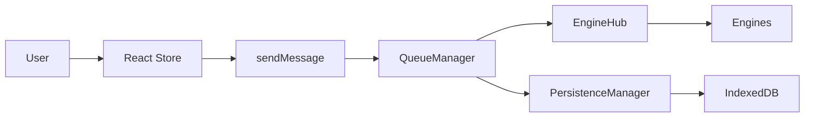
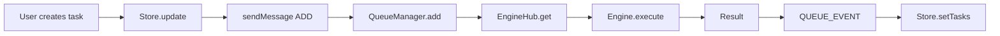
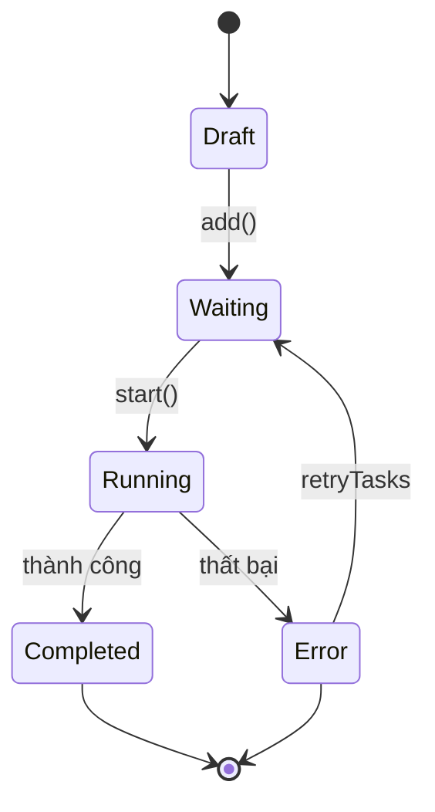
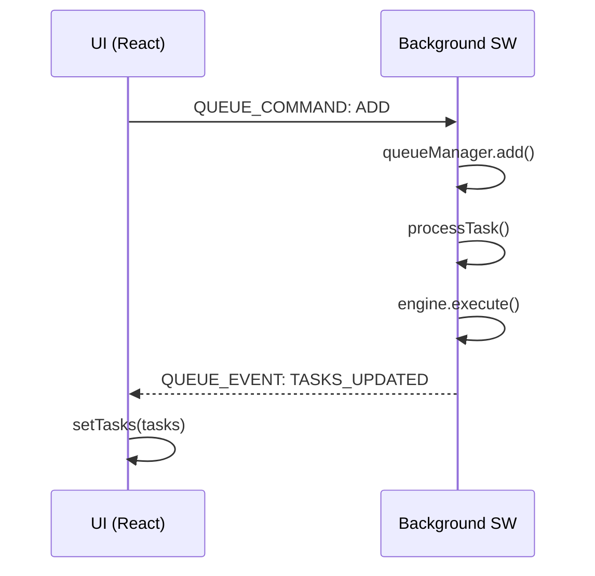

# kernel-script

[npm-version]: https://npmjs.org/package/kernel-script
[npm-downloads]: https://npmjs.org/package/kernel-script
[license]: https://mit-license.org
[license-url]: LICENSE

[](https://npmjs.org/package/kernel-script)
[](https://npmjs.org/package/kernel-script)
[](LICENSE)

Trình quản lý hàng đợi tác vụ cho Chrome extensions với xử lý background, persistence, và React hooks.

## Mục lục

- [Bắt đầu nhanh](#bắt-đầu-nhanh)
- [Tính năng](#tính-năng)
- [Kiến trúc](#kiến-trúc)
- [Cài đặt](#cài-đặt)
- [Sử dụng](#sử-dụng)
  - [Thiết lập cơ bản](#thiết-lập-cơ-bản)
  - [React Hook](#react-hook)
  - [Nâng cao](#nâng-cao)
- [Tham chiếu API](#tham-chiếu-api)
  - [Core](#core)
  - [Hooks](#hooks)
  - [Store](#store)
  - [Thao tác hàng đợi](#thao-tác-hàng-đợi)
- [Các kiểu dữ liệu](#các-kiểu-dữ-liệu)
- [Khắc phục sự cố](#khắc-phục-sự-cố)
- [Đóng góp](#đóng-góp)
- [Giấy phép](#giấy-phép)

## Bắt đầu nhanh

```bash
npm install kernel-script
# hoặc
bun add kernel-script
```

```typescript
import { setupKernelScript, createEngineRegistry, useWorker, createTaskStore } from 'kernel-script';

// 1. Tạo và đăng ký engine của bạn
const registry = createEngineRegistry();
registry.register({
  keycard: 'my-platform',
  execute: async (ctx) => {
    // Logic tự động hóa của bạn ở đây
    return { success: true, output: 'Done' };
  },
});

// 2. Khởi tạo trong background script
setupKernelScript(registry, { debug: true });

// 3. Tạo store và sử dụng hook trong React
const taskStore = createTaskStore({ name: 'my-tasks' });
const TaskQueue = () => {
  const { start, pause, addTask, publishTasks } = useWorker({
    engine: { keycard: 'my-platform', execute: async (ctx) => ({ success: true }) },
    identifier: 'default',
    funcs: taskStore,
  });
  // ...
};
```

```typescript
import { setupKernelScript, registerEngines, useWorker, createTaskStore } from 'kernel-script';

// 1. Định nghĩa engine của bạn
const myEngine = {
  keycard: 'my-platform',
  execute: async (ctx) => {
    // Logic tự động hóa của bạn ở đây
    return { success: true, output: 'Done' };
  },
};

// 2. Khởi tạo trong background script
setupKernelScript({ 'my-platform': myEngine });

// 3. Tạo store và sử dụng hook trong React
const taskStore = createTaskStore({ name: 'my-tasks' });
const TaskQueue = () => {
  const { start, pause, addTask } = useWorker({
    keycard: 'my-platform',
    getIdentifier: () => 'default',
    funcs: taskStore,
  });
  // ...
};
```

## Ví dụ

Xem thư mục [`example/`](example/) để xem project hoàn chỉnh sử dụng kernel-script.

```bash
cd example
bun install
bun dev
```

| File                                                                           | Mô tả                           |
| ------------------------------------------------------------------------------ | ------------------------------- |
| [`example/src/background.ts`](example/src/background.ts)                       | Thiết lập engine với registry   |
| [`example/src/hooks/use-task-worker.ts`](example/src/hooks/use-task-worker.ts) | Cách sử dụng queue hook         |
| [`example/src/stores/task.store.ts`](example/src/stores/task.store.ts)         | Store với IndexedDB persistence |

### Mới trong v2.0

- **DirectManager** - Thực thi tác vụ ngay lập tức không qua hàng đợi
- **Engine Registry** - Hệ thống registry mới cho engine
- **QueueOptions** - Callback hooks cho các sự kiện hàng đợi
- **`publishTasks()`** - Đăng tác vụ local lên hàng đợi
- **`cancelTasks()`** / **`skipTaskIds()`** - Thao tác tác vụ theo batch
- **`setTaskConfig()`** - Cập nhật cấu hình runtime
- **Task History** - Theo dõi tác vụ đã hoàn thành (tối đa 1000)
- **Multi-select** - Chọn nhiều tác vụ cùng lúc

## Tính năng

- **Quản lý hàng đợi tác vụ** - Queue, lên lịch, và thực thi tác vụ với concurrency có thể cấu hình
- **Xử lý Background** - Chạy tác vụ trong Chrome background service workers
- **Persistence** - Trạng thái hàng đợi được lưu qua các lần khởi động extension
- **React Hooks** - Hook `useWorker` tích hợp sẵn cho React
- **Hệ thống Engine** - Kiến trúc engine có thể mở rộng cho các loại tác vụ khác nhau
- **Hỗ trợ TypeScript** - Hỗ trợ TypeScript đầy đủ với type definitions

## Kiến trúc

### Luồng dữ liệu



### Các thành phần

| Layer | Component           | Mô tả                                  |
| ----- | ------------------- | -------------------------------------- |
| UI    | TaskStore (Zustand) | Quản lý state cục bộ                   |
| UI    | useWorker Hook      | Interface React hook                   |
| BG    | QueueManager        | Lên lịch tác vụ, kiểm soát concurrency |
| BG    | EngineHub           | Engine router/registry                 |
| BG    | PersistenceManager  | IndexedDB persistence                  |
| BG    | Engines             | Thực thi tác vụ                        |

### Luồng tác vụ

#### Luồng thực thi tác vụ



### Vòng đời tác vụ



### Persistence & Hydration

| Sự kiện                   | Hành động                                                |
| ------------------------- | -------------------------------------------------------- |
| Khởi động lại trình duyệt | Service Worker khởi động lại                             |
| Hydrate                   | Load trạng thái hàng đợi từ IndexedDB                    |
| RehydrateTasks            | Quét tác vụ, reset Running → Waiting, thêm lại vào queue |

### Luồng tin nhắn



### Các thao tác chính

| Thao tác          | Mô tả                                |
| ----------------- | ------------------------------------ |
| `add(task)`       | Thêm 1 tác vụ vào hàng đợi           |
| `addMany(tasks)`  | Thêm nhiều tác vụ                    |
| `start()`         | Bắt đầu xử lý hàng đợi               |
| `pause()`         | Tạm dừng (không hủy tác vụ)          |
| `resume()`        | Tiếp tục xử lý                       |
| `stop()`          | Dừng và halt tất cả tác vụ đang chạy |
| `haltTask(id)`    | Halt 1 tác vụ → Waiting              |
| `cancelTask(id)`  | Hủy hoàn toàn khỏi danh sách         |
| `retryTasks(ids)` | Thử lại các tác vụ thất bại          |

## Cài đặt

```bash
npm install kernel-script
# hoặc
bun add kernel-script
```

## Sử dụng

### Thiết lập cơ bản

```typescript
import {
  setupKernelScript,
  createEngineRegistry,
  type TaskContext,
  type EngineResult,
} from 'kernel-script';

// Định nghĩa engine tùy chỉnh của bạn
const myEngine = {
  keycard: 'my-platform',

  async execute(ctx: TaskContext): Promise<EngineResult> {
    try {
      const tab = await chrome.tabs.create({ url: ctx.payload.url });
      await this.runAutomation(tab.id, ctx);
      const output = await this.getResult(tab.id);
      return { success: true, output };
    } catch (error) {
      return { success: false, error: error.message };
    }
  },
};

// Tạo registry và đăng ký engine
const registry = createEngineRegistry();
registry.register(myEngine);

// Khởi tạo trong background script của bạn
setupKernelScript(registry, { debug: true });
// See: example/src/background.ts
```

### React Hook

```typescript
import { useWorker, createTaskStore, type Task } from 'kernel-script';

// Tạo task store
const taskStore = createTaskStore({ name: 'my-tasks' });

// Sử dụng trong component của bạn
function TaskQueue() {
  const { start, pause, resume, stop, publishTasks, deleteTasks, retryTasks, cancelTasks, skipTaskIds } = useWorker({
    engine: { keycard: 'my-platform', execute: async (ctx) => ({ success: true }) },
    identifier: 'default',
    funcs: taskStore,
  });

  const handleAddTasks = (tasks: Task[]) => {
    publishTasks(tasks);  // Thêm tác vụ vào hàng đợi
  };

  return (
    <div>
      <h2>Tasks: {taskStore.getTasks().length}</h2>
      <button onClick={start}>Start</button>
      <button onClick={pause}>Pause</button>
      <button onClick={resume}>Resume</button>
      <button onClick={stop}>Stop</button>
    </div>
  );
}
// See: example/src/hooks/use-task-worker.ts
```

### Store với Persistence

```typescript
import { createTaskStore, createIndexedDBStorage } from 'kernel-script';

const store = createTaskStore({
  name: 'my-tasks',
  storage: createIndexedDBStorage('my-storage'),
  partialize: (state) => ({
    config: state.config,
  }),
  extend: (set, _get) => ({
    config: { theme: 'light' },
    updateConfig: (updates) => set((state) => ({
      config: { ...state.config, ...updates },
    })),
  })),
});
// Store bao gồm: tasks, taskHistory, selectedIds, taskConfig
// See: example/src/stores/task.store.ts
```

### Thực thi trực tiếp (Không qua hàng đợi)

```typescript
import { getDirectManager, type Task, type EngineResult } from 'kernel-script';

const directManager = getDirectManager();

const task: Task = {
  id: 'task-001',
  no: 1,
  name: 'Generate cat image',
  status: 'Waiting',
  progress: 0,
  payload: { url: 'https://example.com' },
};

const result: EngineResult = await directManager.execute('my-platform', task);
// Sử dụng thực thi trực tiếp khi không cần quản lý hàng đợi
```

### Nâng cao

```typescript
import { getQueueManager, TaskConfig } from 'kernel-script';

// Lấy instance queue manager
const queueManager = getQueueManager();

// Cấu hình hàng đợi
const config: TaskConfig = {
  threads: 3,
  delayMin: 1000,
  delayMax: 5000,
  stopOnErrorCount: 5,
};

// Thêm tác vụ
await queueManager.add('my-platform', 'default', {
  id: 'task-001',
  no: 1,
  name: 'Generate cat image',
  status: 'Waiting',
  progress: 0,
  payload: { prompt: 'a cute cat' },
});

// Thêm nhiều tác vụ
await queueManager.addMany('my-platform', 'default', [
  { id: 'task-002', no: 2, name: 'Task 2', status: 'Waiting', progress: 0, payload: {} },
  { id: 'task-003', no: 3, name: 'Task 3', status: 'Waiting', progress: 0, payload: {} },
]);

// Bắt đầu xử lý
queueManager.start('my-platform', 'default');
```

## Tham chiếu API

### Core

| Export                                 | Mô tả                                        |
| -------------------------------------- | -------------------------------------------- |
| `QueueManager`                         | Class quản lý hàng đợi chính                 |
| `getQueueManager()`                    | Lấy singleton queue manager                  |
| `getDirectManager()`                   | Thực thi tác vụ trực tiếp không qua hàng đợi |
| `TaskContext`                          | Context để thực thi tác vụ với abort signal  |
| `setupKernelScript(registry, options)` | Khởi tạo background engine với registry      |
| `createEngineRegistry()`               | Tạo registry engine tùy chỉnh                |
| `registerEngines(engines, qm)`         | Đăng ký engines vào queue manager            |
| `persistenceManager`                   | Lớp persistence                              |
| `sleep(ms)`                            | Hàm sleep dạng Promise                       |

### Queue Options

| Option                        | Mô tả                              |
| ----------------------------- | ---------------------------------- |
| `debug?: boolean`             | Bật debug logging                  |
| `storageKey?: string`         | Key IndexedDB storage              |
| `defaultConcurrency?: number` | Concurrency mặc định (mặc định: 1) |
| `onTaskStart?: fn`            | Callback khi tác vụ bắt đầu        |
| `onTaskComplete?: fn`         | Callback khi tác vụ hoàn thành     |
| `onQueueEmpty?: fn`           | Callback khi hàng đợi trống        |
| `onPendingCountChange?: fn`   | Callback khi số lượng chờ thay đổi |
| `onTasksUpdate?: fn`          | Callback khi tác vụ được cập nhật  |

### Hooks

| Hook                | Mô tả                            | Cách dùng                                  |
| ------------------- | -------------------------------- | ------------------------------------------ |
| `useWorker(config)` | React hook cho thao tác hàng đợi | `useWorker({ engine, identifier, funcs })` |

### Store

| Function                   | Mô tả                        |
| -------------------------- | ---------------------------- |
| `createTaskStore(options)` | Tạo Zustand store cho tác vụ |

### Thao tác hàng đợi

| Thao tác                                   | Mô tả                                |
| ------------------------------------------ | ------------------------------------ |
| `add(keycard, identifier, task)`           | Thêm 1 tác vụ vào hàng đợi           |
| `addMany(keycard, identifier, tasks)`      | Thêm nhiều tác vụ                    |
| `start(keycard, identifier)`               | Bắt đầu xử lý hàng đợi               |
| `pause(keycard, identifier)`               | Tạm dừng (không hủy tác vụ)          |
| `resume(keycard, identifier)`              | Tiếp tục xử lý                       |
| `stop(keycard, identifier)`                | Dừng và halt tất cả tác vụ đang chạy |
| `clear(keycard, identifier)`               | Xóa tất cả tác vụ                    |
| `cancelTask(keycard, identifier, taskId)`  | Hủy + xóa tác vụ                     |
| `haltTask(keycard, identifier, taskId)`    | Dừng tác vụ (reset về Waiting)       |
| `getStatus(keycard, identifier)`           | Lấy trạng thái hàng đợi              |
| `getTasks(keycard, identifier)`            | Lấy tất cả tác vụ                    |
| `retryTasks(keycard, identifier, taskIds)` | Thử lại các tác vụ thất bại          |
| `setConcurrency(keycard, concurrency)`     | Đặt concurrency                      |

## Các kiểu dữ liệu

```typescript
// Trạng thái tác vụ
type TaskStatus = 'Draft' | 'Waiting' | 'Running' | 'Completed' | 'Error' | 'Previous' | 'Skipped';

// Định nghĩa tác vụ
interface Task {
  id: string;
  no: number;
  name: string;
  status: TaskStatus;
  progress: number;
  payload: Record<string, any>;
  output?: unknown;
  errorMessage?: string;
  isQueued?: boolean;
  createAt?: number;
  updateAt?: number;
  [key: string]: unknown;
}

// Cấu hình hàng đợi
interface TaskConfig {
  threads: number;
  delayMin: number;
  delayMax: number;
  stopOnErrorCount: number;
}

// Trạng thái hàng đợi
interface QueueStatus {
  size: number;
  pending: number;
  isRunning: boolean;
}

// Queue options (callbacks)
interface QueueOptions {
  debug?: boolean;
  storageKey?: string;
  defaultConcurrency?: number;
  onTaskStart?: (keycard: string, identifier: string, taskId: string) => void;
  onTaskComplete?: (
    keycard: string,
    identifier: string,
    taskId: string,
    result: EngineResult
  ) => void;
  onQueueEmpty?: (keycard: string, identifier: string) => void;
  onPendingCountChange?: (keycard: string, identifier: string, count: number) => void;
  onTasksUpdate?: (keycard: string, identifier: string, tasks: Task[], status: QueueStatus) => void;
}

// Setup options
interface SetupOptions {
  debug?: boolean;
  storageKey?: string;
}

// Interface Engine
interface BaseEngine {
  keycard: string;
  execute(ctx: TaskContext): Promise<EngineResult>;
}

// Kết quả Engine
interface EngineResult {
  success: boolean;
  output?: unknown;
  error?: string;
}

// Worker methods (kiểu trả về của hook)
interface WorkerMethods {
  addTask: (task: Task) => Promise<any>;
  start: () => Promise<any>;
  stop: () => Promise<any>;
  pause: () => Promise<any>;
  resume: () => Promise<any>;
  clear: () => Promise<any>;
  getStatus: () => Promise<any>;
  getTasks: () => Promise<any>;
  cancelTask: (taskId: string) => Promise<any>;
  cancelTasks: (taskIds: string[]) => Promise<any>;
  publishTasks: (tasks: Task[]) => Promise<any>;
  deleteTasks: (taskIds: string[]) => Promise<any>;
  retryTasks: (taskIds: string[]) => Promise<any>;
  skipTaskIds: (taskIds: string[]) => Promise<any>;
  setTaskConfig: (taskConfig: TaskConfig) => Promise<any>;
}
```

## Khắc phục sự cố

### Các vấn đề thường gặp

**Q: Tác vụ không thực thi sau khi thêm**
A: Đảm bảo gọi `start()` sau khi thêm tác vụ, hoặc dùng `publishTasks()` để thêm và queue trong một bước.

**Q: Hàng đợi không lưu sau khi khởi động lại extension**
A: Xác minh `setupKernelScript()` được gọi khi bootstrap. Kiểm tra quyền IndexedDB.

**Q: React hook không cập nhật**
A: Đảm bảo store được truyền đúng vào tham số funcs của `useWorker`. Kiểm tra chrome.runtime.id tồn tại.

**Q: Engine không tìm thấy**
A: Đăng ký engine với `createEngineRegistry().register(engine)` trước khi gọi `setupKernelScript()`.

**Q: "No engine registered for platform"**
A: Đảm bảo keycard của engine khớp với keycard bạn dùng trong addTask/publishTasks.

**Q: Lỗi TypeScript khi import**
A: Đảm bảo cài đặt peer dependencies: `npm install react react-dom zustand`

**Q: Không biết bắt đầu từ đâu?**
A: Xem thư mục [`example/`](example/) để xem implementation hoàn chỉnh.

## Đóng góp

1. Fork repository
2. Tạo feature branch: `git checkout -b feature/my-feature`
3. Thực hiện thay đổi của bạn
4. Chạy build: `bun run build`
5. Gửi pull request

## Giấy phép

MIT License - xem [LICENSE](LICENSE) để biết chi tiết.
