# kernel-script

[npm-version]: https://npmjs.org/package/kernel-script
[npm-downloads]: https://npmjs.org/package/kernel-script
[license]: https://mit-license.org
[license-url]: LICENSE

[](https://npmjs.org/package/kernel-script)
[](https://npmjs.org/package/kernel-script)
[](LICENSE)

Trình quản lý hàng đợi tác vụ cho Chrome extensions với xử lý background, persistence, và React hooks.

## Mục lục

- [Bắt đầu nhanh](#bắt-đầu-nhanh)
- [Tính năng](#tính-năng)
- [Kiến trúc](#kiến-trúc)
  - [Các thành phần](#các-thành-phần)
  - [Luồng dữ liệu](#luồng-dữ-liệu)
  - [Luồng tác vụ](#luồng-tác-vụ)
  - [Vòng đời tác vụ](#vòng-đời-tác-vụ)
  - [Persistence & Hydration](#persistence--hydration)
- [Cài đặt](#cài-đặt)
- [Sử dụng](#sử-dụng)
  - [Thiết lập cơ bản](#thiết-lập-cơ-bản)
  - [React Hook](#react-hook)
  - [Store với Persistence](#store-với-persistence)
- [Tham chiếu API](#tham-chiếu-api)
  - [Core](#core)
  - [Controllers](#controllers)
  - [Services](#services)
  - [Queue Options](#queue-options)
  - [Direct Options](#direct-options)
  - [Queue Service Methods](#queue-service-methods)
  - [Task Service Methods](#task-service-methods)
  - [Direct Service Methods](#direct-service-methods)
  - [Hooks](#hooks)
  - [Store](#store)
  - [Bootstrap & Setup](#bootstrap--setup)
  - [Controllers (Background Script)](#controllers-background-script)
- [Các kiểu dữ liệu](#các-kiểu-dữ-liệu)
- [Khắc phục sự cố](#khắc-phục-sự-cố)
- [Đóng góp](#đóng-góp)
- [Giấy phép](#giấy-phép)

## Bắt đầu nhanh

```bash
npm install kernel-script
# hoặc
bun add kernel-script
```

```typescript
import { bootstrap, createEngineRegistry, useWorker } from 'kernel-script';

const registry = createEngineRegistry();
registry.register({
  keycard: 'my-platform',
  execute: async (ctx) => ({ success: true, output: 'Done' }),
});

bootstrap(registry, { debug: true });

function TaskQueue() {
  const { start, pause, publishTasks } = useWorker({
    engine: { keycard: 'my-platform', execute: async (ctx) => ({ success: true }) },
    identifier: 'default',
  });
  // ...
}
```

## Ví dụ

Xem thư mục [`example/`](example/) để xem project hoàn chỉnh.

```bash
cd example
bun install
bun dev
```

## Tính năng

- **Quản lý hàng đợi tác vụ** - Queue, lên lịch, và thực thi tác vụ với concurrency có thể cấu hình
- **Xử lý Background** - Chạy tác vụ trong Chrome background service workers
- **Persistence** - Trạng thái hàng đợi được lưu qua các lần khởi động extension
- **React Hooks** - Hook `useWorker` tích hợp sẵn cho React
- **Hệ thống Engine** - Kiến trúc engine có thể mở rộng cho các loại tác vụ khác nhau
- **Hỗ trợ TypeScript** - Hỗ trợ TypeScript đầy đủ với type definitions

## Kiến trúc

Thư viện này sử dụng kiến trúc nhiều lớp với Controllers, Services, và Repositories để quản lý thực thi tác vụ trong Chrome extensions.

### Các thành phần

| Lớp          | Component        | Mô tả                                     |
| ------------ | ---------------- | ----------------------------------------- |
| Bootstrap    | bootstrap        | Khởi tạo background script                |
| Controllers  | QueueController  | Xử lý COMMANDS (add, start, stop...) |
| Controllers  | DirectController | Xử lý DIRECT_COMMAND (execute, stop...)   |
| Services     | TaskService      | CRUD tác vụ: create, update, publishTasks |
| Services     | QueueService     | Quản lý hàng đợi, concurrency, callbacks  |
| Services     | DirectService    | Thực thi trực tiếp không qua hàng đợi     |
| Repositories | TaskRepository   | IndexedDB persistence                     |
| Events       | EventEmitter     | Broadcast cập nhật tới UI                 |

### Luồng dữ liệu

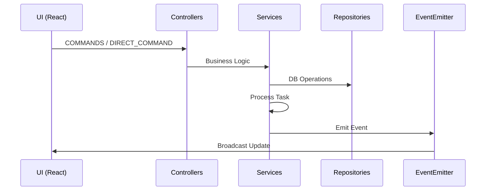

### Luồng tác vụ

#### Luồng tạo (createTask)

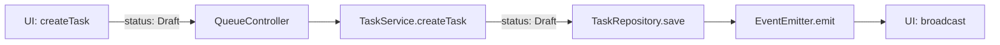

| Bước | Component       | Task Status | Mô tả                        |
| ---- | --------------- | ----------- | ---------------------------- |
| 1    | UI              | -           | User gọi `createTask(input)` |
| 2    | QueueController | -           | Nhận COMMANDS           |
| 3    | TaskService     | Draft       | Tạo task trong DB            |
| 4    | TaskRepository  | Draft       | Lưu task với status: Draft   |
| 5    | EventEmitter    | -           | Broadcast tới UI             |

#### Luồng đăng (publishTasks)

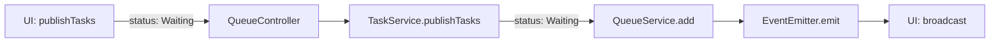

| Bước | Component       | Task Status | Mô tả                            |
| ---- | --------------- | ----------- | -------------------------------- |
| 1    | UI              | Draft       | User gọi `publishTasks(taskIds)` |
| 2    | QueueController | -           | Nhận COMMANDS               |
| 3    | TaskService     | Waiting     | Cập nhật status Waiting          |
| 4    | QueueService    | Waiting     | Thêm vào queue                   |
| 5    | EventEmitter    | -           | Broadcast tới UI                 |

#### Luồng thực thi hàng đợi (queueStart)

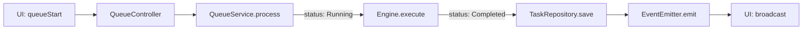

| Bước | Component       | Task Status | Mô tả                     |
| ---- | --------------- | ----------- | ------------------------- |
| 1    | UI              | Waiting     | User gọi `queueStart()`   |
| 2    | QueueController | -           | Nhận COMMANDS        |
| 3    | QueueService    | Running     | Cập nhật status Running   |
| 4    | Engine          | Running     | Thực thi logic            |
| 5    | EngineResult    | Completed   | Thành công: lưu kết quả   |
| 6    | TaskRepository  | Completed   | Cập nhật task với kết quả |
| 7    | EventEmitter    | -           | Broadcast tới UI          |

#### Luồng thực thi trực tiếp (runTask)

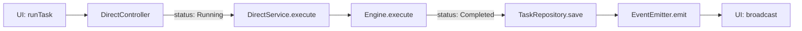

| Bước | Component        | Task Status | Mô tả                      |
| ---- | ---------------- | ----------- | -------------------------- |
| 1    | UI               | Waiting     | User gọi `runTask(taskId)` |
| 2    | DirectController | -           | Nhận DIRECT_COMMAND        |
| 3    | DirectService    | Running     | Đặt status Running         |
| 4    | Engine           | Running     | Thực thi trực tiếp         |
| 5    | EngineResult     | Completed   | Thành công: lưu kết quả    |
| 6    | TaskRepository   | Completed   | Cập nhật task với kết quả  |
| 7    | EventEmitter     | -           | Broadcast tới UI           |

#### Luồng dừng (queueStop)

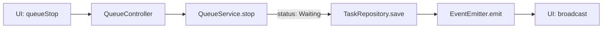

| Bước | Component       | Task Status | Mô tả                   |
| ---- | --------------- | ----------- | ----------------------- |
| 1    | UI              | Running     | User gọi `queueStop()`  |
| 2    | QueueController | -           | Nhận COMMANDS      |
| 3    | QueueService    | Waiting     | Reset Running → Waiting |
| 4    | TaskRepository  | Waiting     | Lưu status              |
| 5    | EventEmitter    | -           | Broadcast tới UI        |

#### Luồng hủy (queueCancelTask)

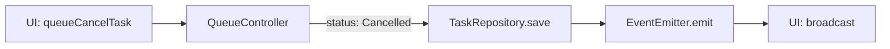

| Bước | Component       | Task Status     | Mô tả                          |
| ---- | --------------- | --------------- | ------------------------------ |
| 1    | UI              | Waiting/Running | User gọi `queueCancelTask(id)` |
| 2    | QueueController | -               | Nhận COMMANDS             |
| 3    | TaskRepository  | Cancelled       | Đặt status Cancelled           |
| 4    | EventEmitter    | -               | Broadcast tới UI               |

#### Luồng xóa all (queueClear)

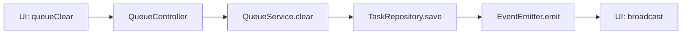

| Bước | Component       | Task Status | Mô tả                     |
| ---- | --------------- | ----------- | ------------------------- |
| 1    | UI              | -           | User gọi `queueClear()`   |
| 2    | QueueController | -           | Nhận COMMANDS        |
| 3    | QueueService    | -           | Xóa all tasks trong queue |
| 4    | TaskRepository  | -           | Xóa all tasks khỏi DB     |
| 5    | EventEmitter    | -           | Broadcast tới UI          |

#### Luồng thử lại (retryTask)

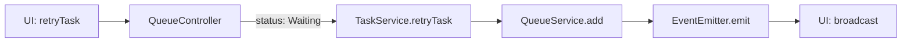

| Bước | Component       | Task Status | Mô tả                        |
| ---- | --------------- | ----------- | ---------------------------- |
| 1    | UI              | Error       | User gọi `retryTask(taskId)` |
| 2    | QueueController | -           | Nhận COMMANDS           |
| 3    | TaskService     | Waiting     | Reset Error → Waiting        |
| 4    | QueueService    | Waiting     | Thêm lại vào queue           |
| 5    | EventEmitter    | -           | Broadcast tới UI             |

#### Luồng bỏ qua (skipTask)

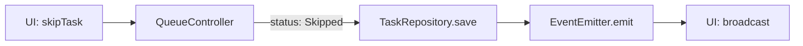

| Bước | Component       | Task Status | Mô tả                       |
| ---- | --------------- | ----------- | --------------------------- |
| 1    | UI              | Running     | User gọi `skipTask(taskId)` |
| 2    | QueueController | -           | Nhận COMMANDS          |
| 3    | TaskRepository  | Skipped     | Đặt status Skipped          |
| 4    | EventEmitter    | -           | Broadcast tới UI            |

#### Luồng xóa (deleteTask)

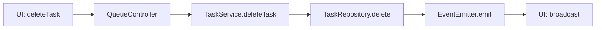

| Bước | Component       | Task Status | Mô tả                         |
| ---- | --------------- | ----------- | ----------------------------- |
| 1    | UI              | Any         | User gọi `deleteTask(taskId)` |
| 2    | QueueController | -           | Nhận COMMANDS            |
| 3    | TaskService     | -           | Kiểm tra task tồn tại         |
| 4    | TaskRepository  | -           | Xóa khỏi DB                   |
| 5    | EventEmitter    | -           | Broadcast tới UI              |

### Vòng đời tác vụ

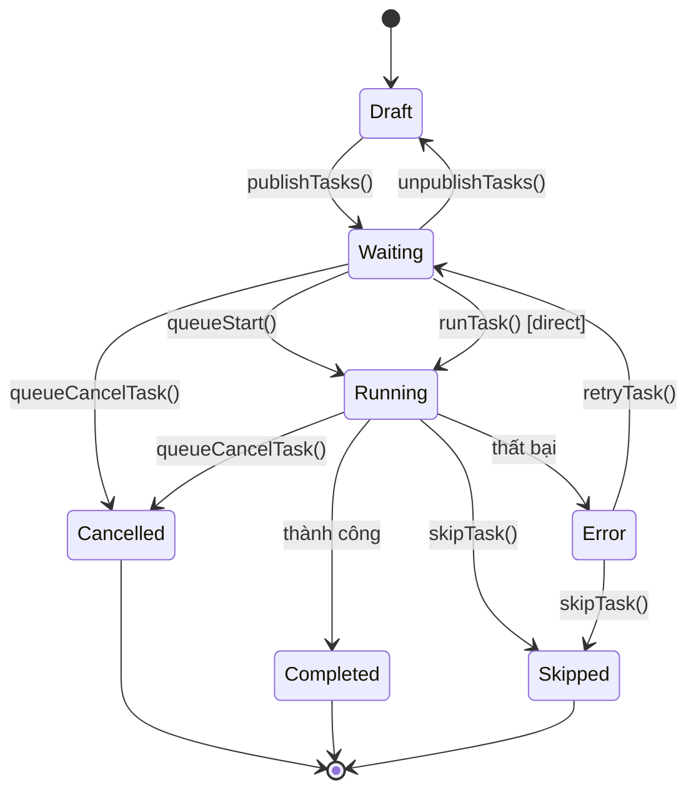

### Persistence & Hydration

| Sự kiện                   | Hành động                                      |
| ------------------------- | ---------------------------------------------- |
| Khởi động lại trình duyệt | Service Worker khởi động lại                   |
| bootstrap()               | Load trạng thái hàng đợi từ IndexedDB          |
| RehydrateTasks            | Quét tác vụ, reset Running → Waiting, thêm lại |

## Cài đặt

```bash
npm install kernel-script
# hoặc
bun add kernel-script
```

## Sử dụng

### Thiết lập cơ bản

```typescript
import {
  bootstrap,
  createEngineRegistry,
  type TaskContext,
  type EngineResult,
} from 'kernel-script';

const myEngine = {
  keycard: 'my-platform',

  async execute(ctx: TaskContext): Promise<EngineResult> {
    try {
      const tab = await chrome.tabs.create({ url: ctx.payload.url });
      await this.runAutomation(tab.id, ctx);
      const output = await this.getResult(tab.id);
      return { success: true, output };
    } catch (error) {
      return { success: false, error: error.message };
    }
  },
};

const registry = createEngineRegistry();
registry.register(myEngine);

bootstrap(registry, { debug: true });
```

### React Hook

```typescript
import { useWorker, type Task } from 'kernel-script';

function TaskQueue() {
  const {
    start,
    pause,
    resume,
    stop,
    publishTasks,
    deleteTasks,
    retryTasks,
    cancelTasks,
    skipTaskIds,
  } = useWorker({
    engine: { keycard: 'my-platform', execute: async (ctx) => ({ success: true }) },
    identifier: 'default',
  });

  const handleAddTasks = (tasks: Task[]) => {
    publishTasks(tasks);
  };
  // ...
}
```

## Tham chiếu API

### Core

| Export                          | Mô tả                                   |
| ------------------------------- | --------------------------------------- |
| `bootstrap(registry, options)`  | Khởi tạo background script với services |
| `setupKernelScript(config)`     | Khởi tạo legacy (tương thích ngược)     |
| `createEngineRegistry()`        | Tạo engine registry                     |
| `registerEngines(engines, svc)` | Đăng ký engines vào service             |

### Controllers

| Export                     | Mô tả                      |
| -------------------------- | -------------------------- |
| `createQueueController()`  | Tạo queue command handler  |
| `createDirectController()` | Tạo direct command handler |

### Services

| Export                     | Mô tả                                |
| -------------------------- | ------------------------------------ |
| `getQueueService(options)` | Lấy queue service singleton          |
| `taskService`              | Task CRUD service (singleton)        |
| `directService`            | Direct execution service (singleton) |
| `taskRepository`           | IndexedDB repository (singleton)     |
| `emitEvent(event, data)`   | Emit event tới tất cả UI clients     |
| `EVENTS`                   | Event type constants                 |

### Queue Options

| Option                        | Mô tả                              |
| ----------------------------- | ---------------------------------- |
| `debug?: boolean`             | Bật debug logging                  |
| `storageKey?: string`         | Key IndexedDB storage              |
| `defaultConcurrency?: number` | Concurrency mặc định (mặc định: 1) |
| `onTaskStart?: fn`            | Callback khi tác vụ bắt đầu        |
| `onTaskComplete?: fn`         | Callback khi tác vụ hoàn thành     |
| `onQueueEmpty?: fn`           | Callback khi hàng đợi trống        |
| `onPendingCountChange?: fn`   | Callback khi số lượng chờ thay đổi |
| `onTasksUpdate?: fn`          | Callback khi tác vụ được cập nhật  |

### Direct Options

| Option                | Mô tả                             |
| --------------------- | --------------------------------- |
| `debug?: boolean`     | Bật debug logging                 |
| `onTasksUpdate?: fn`  | Callback khi tác vụ được cập nhật |
| `onTaskComplete?: fn` | Callback khi tác vụ hoàn thành    |

### Queue Service Methods

| Method                                     | Mô tả                                |
| ------------------------------------------ | ------------------------------------ |
| `add(keycard, identifier, task)`           | Thêm 1 tác vụ vào hàng đợi           |
| `addMany(keycard, identifier, tasks)`      | Thêm nhiều tác vụ                    |
| `start(keycard, identifier)`               | Bắt đầu xử lý hàng đợi               |
| `pause(keycard, identifier)`               | Tạm dừng (không hủy tác vụ)          |
| `resume(keycard, identifier)`              | Tiếp tục xử lý                       |
| `stop(keycard, identifier)`                | Dừng và halt tất cả tác vụ đang chạy |
| `clear(keycard, identifier)`               | Xóa tất cả tác vụ                    |
| `cancelTask(keycard, identifier, taskId)`  | Hủy + xóa tác vụ                     |
| `haltTask(keycard, identifier, taskId)`    | Halt tác vụ (reset về Waiting)       |
| `getStatus(keycard, identifier)`           | Lấy trạng thái hàng đợi              |
| `getTasks(keycard, identifier)`            | Lấy tất cả tác vụ                    |
| `retryTasks(keycard, identifier, taskIds)` | Thử lại các tác vụ thất bại          |
| `setConcurrency(keycard, concurrency)`     | Đặt concurrency                      |

### Task Service Methods

| Method                    | Mô tả                    |
| ------------------------- | ------------------------ |
| `createTask(task)`        | Tạo tác vụ mới           |
| `updateTask(id, updates)` | Cập nhật tác vụ          |
| `deleteTask(id)`          | Xóa tác vụ               |
| `getTask(id)`             | Lấy tác vụ theo ID       |
| `publishTasks(tasks)`     | Thêm tác vụ vào hàng đợi |

### Direct Service Methods

| Method                           | Mô tả                     |
| -------------------------------- | ------------------------- |
| `execute(keycard, id, task)`     | Thực thi tác vụ trực tiếp |
| `stop(keycard, id, taskId)`      | Dừng tác vụ đang chạy     |
| `isRunning(keycard, id, taskId)` | Kiểm tra đang chạy        |

### Hooks

| Hook                | Mô tả                            | Cách dùng                                   |
| ------------------- | -------------------------------- | ------------------------------------------- |
| `useWorker(config)` | React hook cho thao tác hàng đợi | `useWorker({ engine, identifier, debug? })` |

### Bootstrap & Setup

```typescript
import { bootstrap, createEngineRegistry } from 'kernel-script';

const registry = createEngineRegistry();
registry.register({
  keycard: 'my-platform',
  execute: async (ctx) => ({ success: true, output: 'Done' }),
});

bootstrap(registry, { debug: true });
```

### Controllers (Background Script)

```typescript
import { createQueueController, createDirectController } from 'kernel-script';

const queueController = createQueueController();
const directController = createDirectController();

chrome.runtime.onMessage.addListener((message, sender, sendResponse) => {
  if (message.type === 'COMMANDS') {
    queueController.handle(message, sendResponse);
  } else if (message.type === 'DIRECT_COMMAND') {
    directController.handle(message, sendResponse);
  }
});
```

## Các kiểu dữ liệu

```typescript
// Trạng thái tác vụ
type TaskStatus = 'Draft' | 'Waiting' | 'Running' | 'Completed' | 'Error' | 'Previous' | 'Skipped';

// Định nghĩa tác vụ
interface Task {
  id: string;
  no: number;
  name: string;
  status: TaskStatus;
  progress: number;
  payload: Record<string, any>;
  result?: EngineResult;
  errorMessage?: string;
  isQueued: boolean;
  createAt: number;
  updateAt: number;
  histories: TaskHistory[];
  [key: string]: any;
}

// Task input (để tạo tác vụ)
type TaskInput = {
  name: Task['name'];
  payload: Task['payload'];
  [key: string]: any;
};

// Lịch sử tác vụ
type TaskHistory = {
  result: EngineResult;
  updateAt: number;
};

// Kết quả async
type AsyncResult = {
  success: boolean;
};

// Cấu hình hàng đợi
type TaskConfig = {
  threads: number;
  delayMin: number;
  delayMax: number;
  stopOnErrorCount: number;
  [key: string]: any;
};

// Trạng thái hàng đợi
type QueueStatus = {
  size: number;
  pending: number;
  isRunning: boolean;
};

// Queue options (callbacks)
type QueueOptions = {
  debug?: boolean;
  storageKey?: string;
  defaultConcurrency?: number;
  onTaskStart?: (keycard: string, identifier: string, taskId: string) => void;
  onTaskComplete?: (
    keycard: string,
    identifier: string,
    taskId: string,
    result: EngineResult
  ) => void;
  onQueueEmpty?: (keycard: string, identifier: string) => void;
  onPendingCountChange?: (keycard: string, identifier: string, count: number) => void;
  onTasksUpdate?: (keycard: string, identifier: string, tasks: Task[], status: QueueStatus) => void;
};

// Direct options (callbacks)
type DirectOptions = {
  debug?: boolean;
  storageKey?: string;
  onTasksUpdate?: (keycard: string, identifier: string, task: Task) => void;
  onTaskComplete?: (
    keycard: string,
    identifier: string,
    taskId: string,
    result: EngineResult
  ) => void;
};

// Setup options
type SetupOptions = {
  debug?: boolean;
  storageKey?: string;
};

// Interface Engine
type BaseEngine = {
  keycard: string;
  execute(ctx: any): Promise<EngineResult>;
};

// Kết quả Engine
type EngineResult = {
  success: boolean;
  output?: unknown;
  error?: string;
};

// Worker methods (kiểu trả về của hook)
interface WorkerMethods {
  tasks: Task[];
  isRunning: boolean;
  selectedIds: string[];
  taskConfig: TaskConfig;
  setTaskConfig: (config: TaskConfig) => Promise<void>;
  createTask: (input: TaskInput) => Promise<AsyncResult>;
  createTasks: (inputs: TaskInput[]) => Promise<AsyncResult>;
  deleteTask: (taskId: string) => Promise<AsyncResult>;
  deleteTasks: (taskIds: string[]) => Promise<AsyncResult>;
  publishTasks: (taskIds: string[]) => Promise<AsyncResult>;
  unpublishTasks: (taskIds: string[]) => Promise<AsyncResult>;
  queueStart: () => Promise<AsyncResult>;
  queueStop: () => Promise<AsyncResult>;
  queueCancelTask: (taskId: string) => Promise<AsyncResult>;
  queueClear: () => Promise<AsyncResult>;
  retryTask: (taskId: string) => Promise<AsyncResult>;
  skipTask: (taskId: string) => Promise<AsyncResult>;
  toggleSelect: (taskId: string) => Promise<void>;
  toggleSelectAll: (taskIds?: string[]) => Promise<void>;
  clearSelected: () => Promise<void>;
  runTask: (taskId: string) => Promise<EngineResult>;
  stopTask: (taskId: string) => Promise<AsyncResult>;
  sync: () => void;
}
```

## Khắc phục sự cố

### Các vấn đề thường gặp

**Q: Tác vụ không thực thi sau khi thêm**
A: Đảm bảo gọi `queueStart()` sau khi thêm tác vụ, hoặc dùng `publishTasks()` để thêm và queue trong một bước.

**Q: Hàng đợi không lưu sau khi khởi động lại extension**
A: Xác minh `bootstrap()` được gọi khi khởi động. Kiểm tra quyền IndexedDB.

**Q: React hook không cập nhật**
A: Đảm bảo store được truyền đúng vào tham số funcs của `useWorker`. Kiểm tra chrome.runtime.id tồn tại.

**Q: Engine không tìm thấy**
A: Đăng ký engine với `createEngineRegistry().register(engine)` trước khi gọi `bootstrap()`.

**Q: "No engine registered for platform"**
A: Đảm bảo keycard của engine khớp với keycard bạn dùng trong addTask/publishTasks.

**Q: Lỗi TypeScript khi import**
A: Đảm bảo cài đặt peer dependencies: `npm install react react-dom`

**Q: Không biết bắt đầu từ đâu?**
A: Xem thư mục [`example/`](example/) để xem implementation hoàn chỉnh.

## Đóng góp

1. Fork repository
2. Tạo feature branch: `git checkout -b feature/my-feature`
3. Thực hiện thay đổi của bạn
4. Chạy build: `bun run build`
5. Gửi pull request

## Giấy phép

MIT License - xem [LICENSE](LICENSE) để biết chi tiết.
